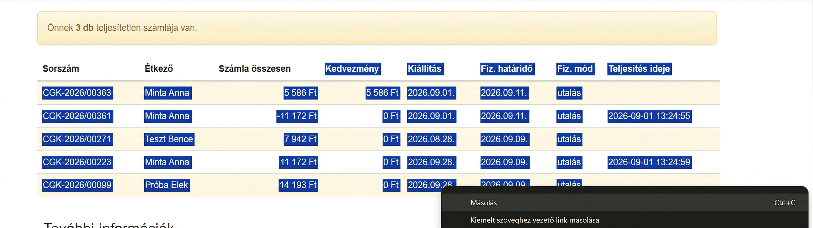
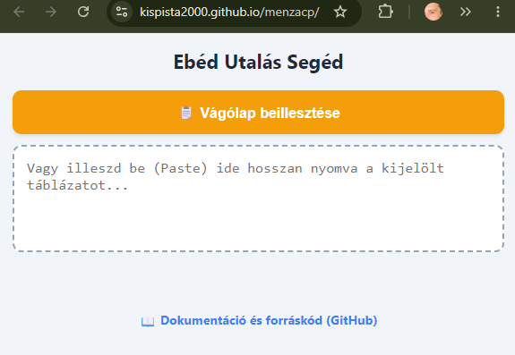
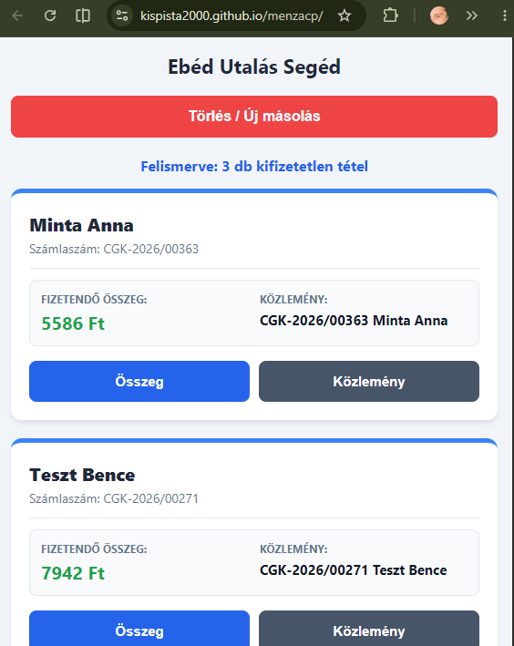

# Ebéd Utalás Segéd 🍽️

**[▶️ Kattints ide az élő alkalmazás megnyitásához!](https://kispista2000.github.io/menzacp/)**

Egy egyszerű, böngészőben futó (kliensoldali) webalkalmazás, amely megkönnyíti az iskolai étkezés számláinak tömeges, manuális átutalását (pl. Revolut vagy más mobilbanki applikációk felületén). 

## 📝 Rövid összefoglaló
A szolgáltatók weboldalairól kimásolt nyers táblázatos adatokból a program automatikusan kinyeri a fizetendő tételeket. Kiszűri a 0 Ft-os, stornózott, vagy már kifizetett számlákat, a fennmaradókat pedig átlátható kártyákká alakítja. A kártyákon található gombok segítségével az **Összeg** (szigorúan szóközök nélkül) és a **Közlemény** egyetlen érintéssel a vágólapra másolható.

Mivel az adatok feldolgozása kizárólag a böngészőben (helyileg) történik, az alkalmazás semmilyen szerverre nem küld érzékeny adatokat.

## 📸 Képernyőképek a folyamatról

### 1. Adatok másolása a menza weboldaláról
Jelöld ki az étkezési felületen a számlákat tartalmazó táblázatot (fejléccel együtt vagy anélkül), és másold a vágólapra.



### 2. Beillesztés az Utalás Segédbe
Illeszd be a szöveget az alkalmazásba a narancssárga gombbal. A program azonnal kártyákra bontja a kifizetetlen tételeket.




## 🚀 Használati útmutató

### Utalás menete
1. Másold ki a számlákat a szolgáltató oldaláról (lásd fenti kép).
2. Nyisd meg az **Ebéd Utalás Segéd** alkalmazást, és nyomj a **📋 Vágólap beillesztése** gombra *(első alkalommal a böngésző engedélyt kérhet a vágólap olvasására)*.
3. Nyomj az **Összeg** gombra a kívánt gyereknél, majd illeszd be a banki applikációdba.
4. Térj vissza, nyomj a **Közlemény** gombra, és illeszd be azt is.
5. Ismételd ezt a kártyákon végighaladva!

### Telepítés (Mobilon)
Az alkalmazást nem kell telepíteni, de a kényelmesebb használat érdekében érdemes kitűzni a kezdőképernyőre:
1. Nyisd meg [az alkalmazás linkjét](https://kispista2000.github.io/menzacp/) a mobilod böngészőjében (pl. Chrome).
2. A böngésző menüjében (jobb felül három pötty) válaszd a **Felvétel a kezdőképernyőre** (Add to Home screen) lehetőséget.
3. Innentől az alkalmazás úgy indul, mint egy natív telefonos app.

## 📋 Minta a beillesztendő (vágólap) nyers szövegre

A táblázatból kimásolt szöveg a vágólapon általában így néz ki (összecsúszott cellákkal, formázatlanul). A szkript pontosan erre a struktúrára van felkészítve:

```text
ÉtkezőSzámla összesenKedvezményKiállításFiz. határidőFiz. módTeljesítés idejeCGK-2026/00363Minta Anna5 586 Ft
5 586 Ft2026.09.01.2026.09.11.utalásCGK-2026/00361Minta Anna-11 172 Ft
0 Ft2026.09.01.2026.09.11.utalás2026-09-01 13:24:55CGK-2026/00271Teszt Bence7 942 Ft
0 Ft2026.08.28.2026.09.09.utalásCGK-2026/00223Kovács Lili11 172 Ft
0 Ft2026.08.28.2026.09.09.utalás2026-09-01 13:24:59CGK-2026/00099Kovács Lili14 193 Ft
0 Ft2026.08.28.2026.09.09.utalás
